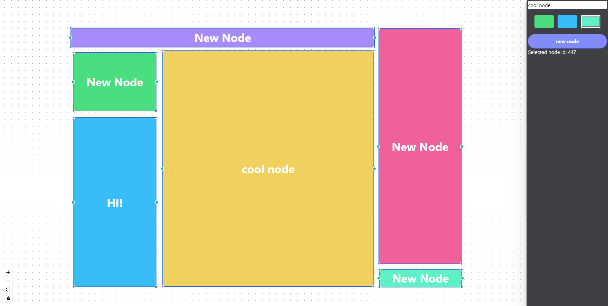
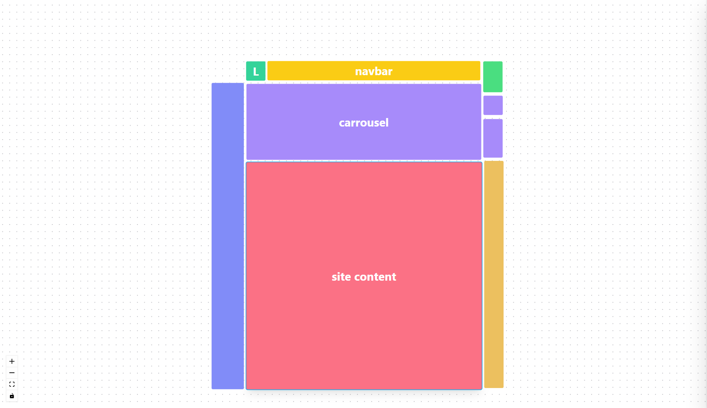
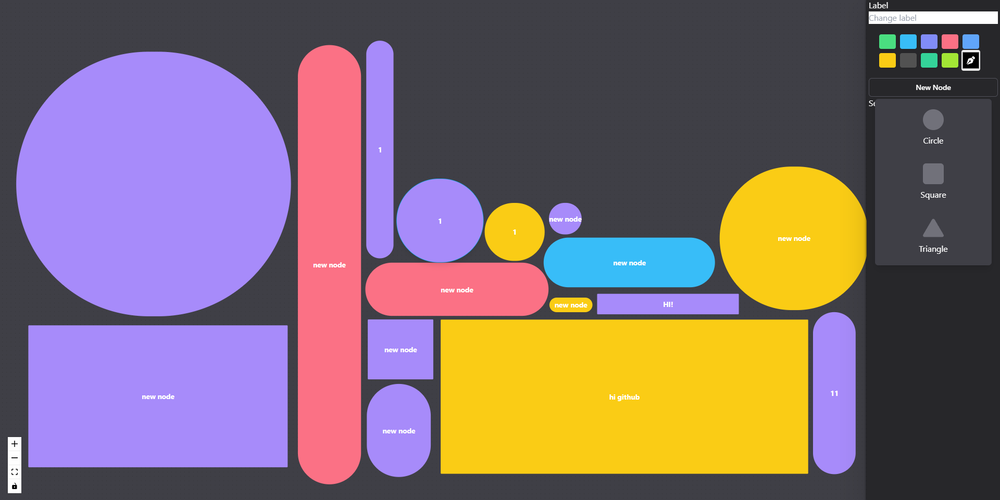

## Getting Started

First, run the development server:

```bash
npm run dev
# or
yarn dev
# or
pnpm dev
```

## About :dizzy:

This project is an experimental ReactFlow application with no ambitions other than a learning resource for the open-source React libraries.

## Images:

Note: this images were taken in differernte versions of the applications.

</img>
</img>
</img>

There are more photos on the path "/public/pictures"
